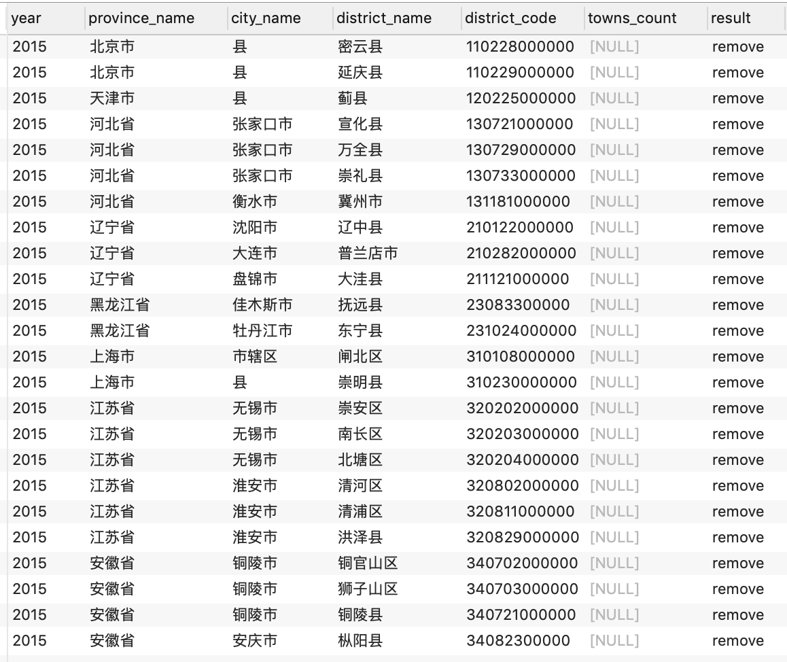
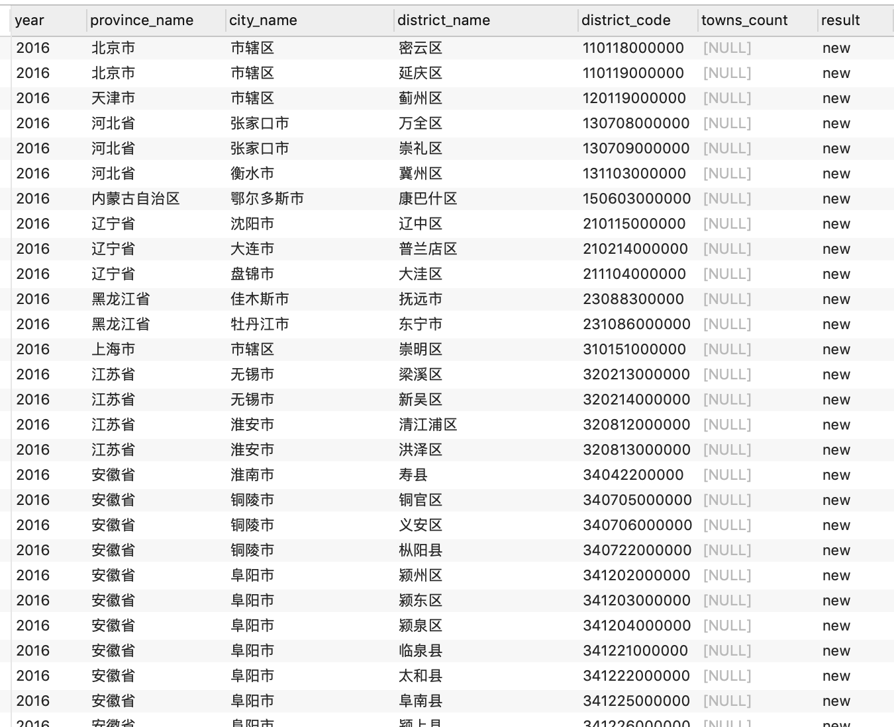

# 中国统计局省市区镇（街道）采集器
node-china-region-spider 是一个基于 nodejs 技术，通过访问中国统计局网，获取省、地级市、区（县）、镇（街道）多层行政级别地区的名字 与 编号，并将数据保存到 SQLite 数据库。

目录结构
- [程序特点](#1-程序特点)
- [数据来源](#2-数据来源)
- [技术构成](#3-技术构成)
- [安装](#4-安装)
- [运行](#5-运行)
- [参数](#6-参数)
- [数据结构](#7-数据结构)
- [年度数据对比](#8-年度数据对比)


## 1. 程序特点
- 支持采集不同的行政级别深度
- 支持采集指定的年份数据，并且支持不同年份数据对比，为每年升级提供数据帮助
- 支持自定义多并发采集，提高整体的运行效率
- 访问超时自动重试
- 支持断点续采，避免被拦截后重新开始采集的代价
- 通过访问频率控制，避免容易被服务器察觉并禁止访问

## 2. 数据来源
数据来源于[国家统计局网](http://www.stats.gov.cn)。  

其中，不同年份的行政区域划分： http://www.stats.gov.cn/tjsj/tjbz/tjyqhdmhcxhfdm/  

## 3. 技术构成
- 数据采集：puppeteer  
  Puppeteer 是一个通过 DevTools Protocol 控制 headless Chrome or Chromium 浏览器的高级 node 库。

- 数据存储： SQLite 文件数据库  
  使用 [sequelize orm](https://github.com/demopark/sequelize-docs-Zh-CN/blob/master/getting-started.md) 进行数据库操作。

  推荐安装 Navicat 客户端，可以查看 SQLite 文件的数据。

- nodejs 库依赖管理：Yarn  
  默认的源安装 puppeteer 经常因为网络问题导致失败，需要采用一下方式：

方式一：修改了源 .npmrc
  
```
type puppeteer_download_host = https://npm.taobao.org/mirrors
```

方式二：使用 npm 单独安装 puppeteer

```
PUPPETEER_DOWNLOAD_HOST=https://storage.googleapis.com.cnpmjs.org npm i puppeteer 
```

## 4. 安装
```sh
# 安装所有的 js 依赖
yarn
```

## 5. 运行
```sh
# 获取最新的记录
node index.js

# 获取指定年份的记录
node index.js -y 2016

# 获取指定行政级别深度的数据（支持 province, city, district, town）
node index.js -d 3
```

## 6. 参数


```sh
# 查看参数指令
$ node index.js --help
```


参数 | 简写 | 值 | 默认值 | 描述  
---|---|---|---|---  
headless | h | y/n | n | 无头模式（没有界面）  
depth | d | 1/2/3/4 | 3 | 采集指定行政级别深度的地区数据 (provice/city/district/town)  
year | y | 数字 | 2016 | 采集指定年份的数据。[查看年份](http://www.stats.gov.cn/tjsj/tjbz/tjyqhdmhcxhfdm/)  
concurrency | c | 数字 | 3 | 并发请求数  
interval | i | 毫秒 | 500 | 采集数据休息的间隙  
timeout | t | 毫秒 | 3000 | 超时重试的时间  


## 7. 数据结构

数据 | 表名 | 字段
---|---|---
省 | provinces | id, name, code, year, citiesCount
地级市 | cities | id, name, code, year, districtsCount, provinceId
区/县 | districts | id, name, code, year, townsCount, cityId
镇/街道办 | towns | id, name, code, year


## 8. 年度数据对比

### 8.1 区(县)的变更
以下是对比 2016年 与 2015年的数据。如果需要对比其他时间，直接更新下面 SQL 脚本上的数字即可。

#### A. 已经删除的区(县)
**SQL查询脚本** 
```sql
select p.year,
    p.name as province_name,
	c.name as city_name,
	d1.name as district_name, 
	d1.code as district_code,
	d1.townsCount as towns_count,
    'remove' as result
from districts as d1
inner join cities as c on c.id=d1.cityId
inner join provinces as p on p.id=c.provinceId
left join districts d2 on d2.year=2016 and d2.code=d1.code and d2.name=d1.name
where d1.year=2015 and d2.code is null
```

**结果输出**  



#### B. 新增的区/县
**SQL查询脚本**  
```sql
select p.year,
    p.name as province_name,
	c.name as city_name,
	d1.name as district_name, 
	d1.code as district_code,
	d1.townsCount as towns_count,
    'new' as result
from districts as d1
inner join cities as c on c.id=d1.cityId
inner join provinces as p on p.id=c.provinceId
left join districts d2 on d2.year=2015 and d2.code=d1.code and d2.name=d1.name
where d1.year=2016 and d2.code is null
```

**结果输出**  



#### C. 系统的地区版本升级
假设某系统使用的是2015年的数据，需要升级到2016年数据，那么需要以下操作：  
1. 找出关联了该区(县)的数据，找替代的区(县)重新关联到该数据
2. 删除上面已移除的区(县)
3. 增加上面新增的区(县)


### 8.2 地级市的变更
同理，脚本稍微调整

**移除的城市**
```sql
select p.year,
  p.name as province_name,
  c1.name as city_name, 
  c1.code as city_code,
  c1.districtsCount as districts_count,
  'remove' as result
from cities c1
inner join provinces as p on p.id=c1.provinceId
left join cities c2 on c2.year=2016 and c2.code=c1.code and c2.name=c1.name
where c1.year=2015 and c2.code is null
```

**新增的城市**
```sql
select p.year,
  p.name as province_name,
  c1.name as city_name, 
  c1.code as city_code,
  c1.districtsCount as districts_count,
  'new' as result
from cities c1
inner join provinces as p on p.id=c1.provinceId
left join cities c2 on c2.year=2015 and c2.code=c1.code and c2.name=c1.name
where c1.year=2016 and c2.code is null
```